# Timmy Time — Mission Control

[](https://github.com/Alexspayne/Timmy-time-dashboard/actions/workflows/tests.yml)

A local-first dashboard for your sovereign AI agents. Talk to Timmy, watch his status, verify Ollama is running — all from a browser, no cloud required.

---

## Prerequisites

You need three things on your Mac before anything else:

**Python 3.11+**
```bash
python3 --version   # should be 3.11 or higher
```
If not: `brew install python@3.11`

**Ollama** (runs the local LLM)
```bash
brew install ollama
```
Or download from https://ollama.com

**Git** — already on every Mac.

---

## Quickstart (copy-paste friendly)

### 1. Clone the branch

```bash
git clone -b claude/run-tests-IYl0F https://github.com/Alexspayne/Timmy-time-dashboard.git
cd Timmy-time-dashboard
```

### 2. Create a virtual environment and install

```bash
python3 -m venv .venv
source .venv/bin/activate
pip install -e ".[dev]"
```

### 3. Pull the model (one-time, ~2 GB download)

Open a **new terminal tab** and run:

```bash
ollama serve
```

Back in your first tab:

```bash
ollama pull llama3.2
```

### 4. Start the dashboard

```bash
uvicorn dashboard.app:app --reload
```

Open your browser to **http://localhost:8000**

---

## Access from your phone

The dashboard is mobile-optimized. To open it on your phone:

**Step 1 — bind to your local network** (instead of just localhost):

```bash
uvicorn dashboard.app:app --host 0.0.0.0 --port 8000 --reload
```

**Step 2 — find your Mac's IP address:**

```bash
ipconfig getifaddr en0
```

This prints something like `192.168.1.42`. If you're on ethernet instead of Wi-Fi, try `en1`.

**Step 3 — open on your phone:**

Make sure your phone is on the **same Wi-Fi network** as your Mac, then open:

```
http://192.168.1.42:8000
```

(replace with your actual IP)

On mobile the layout switches to a single column — status panels become a horizontal scroll strip at the top, chat fills the rest of the screen. The input field is sized to prevent iOS from zooming in when you tap it.

---

## What you'll see

The dashboard has two panels on the left and a chat window on the right:

- **AGENTS** — Timmy's metadata (model, type, version)
- **SYSTEM HEALTH** — live Ollama status, auto-refreshes every 30 seconds
- **TIMMY INTERFACE** — type a message, hit SEND, get a response from the local LLM

If Ollama isn't running when you send a message, the chat will show a "Timmy is offline" error instead of crashing.

---

## Run the tests

No Ollama needed — all external calls are mocked.

```bash
pytest
```

Expected output:
```
27 passed in 0.67s
```

---

## Optional: CLI

With your venv active:

```bash
timmy chat "What is sovereignty?"
timmy think "Bitcoin and self-custody"
timmy status
```

---

## Architecture

```mermaid
graph TD
    Phone["📱 Phone / Browser"]
    Browser["💻 Browser"]

    Phone  -->|HTTP + HTMX| FastAPI
    Browser -->|HTTP + HTMX| FastAPI

    subgraph "Local Machine"
        FastAPI["FastAPI\n(dashboard.app)"]
        Jinja["Jinja2 Templates\n+ static CSS"]
        Timmy["Timmy Agent\n(Agno wrapper)"]
        Ollama["Ollama\n:11434"]
        SQLite[("SQLite\ntimmy.db")]

        FastAPI -->|renders| Jinja
        FastAPI -->|/agents/timmy/chat| Timmy
        FastAPI -->|/health/status ping| Ollama
        Timmy   -->|LLM call| Ollama
        Timmy   -->|conversation memory| SQLite
    end
```



All traffic stays on your local network. No cloud, no telemetry.

## Configuration

Override defaults without touching code — create a `.env` file (see `.env.example`):

```bash
cp .env.example .env
# then edit .env
```

| Variable | Default | Purpose |
|---|---|---|
| `OLLAMA_URL` | `http://localhost:11434` | Ollama host (useful if Ollama runs on another machine) |
| `OLLAMA_MODEL` | `llama3.2` | LLM model served by Ollama |
| `DEBUG` | `false` | Set `true` to enable `/docs` and `/redoc` |

## Project layout

```
src/
  config.py       # pydantic-settings (reads .env)
  timmy/          # Timmy agent — wraps Agno (soul = prompt, body = Agno)
  dashboard/      # FastAPI app + routes + Jinja2 templates
static/           # CSS (dark mission-control theme)
tests/            # pytest suite (27 tests, no Ollama required)
.env.example      # environment variable reference
pyproject.toml    # dependencies and build config
```

---

## Troubleshooting

**`ollama: command not found`** — Ollama isn't installed or isn't on your PATH. Install via Homebrew or the .dmg from ollama.com.

**`connection refused` in the chat** — Ollama isn't running. Open a terminal and run `ollama serve`, then try again.

**`ModuleNotFoundError: No module named 'dashboard'`** — You're not in the venv or forgot `pip install -e .`. Run `source .venv/bin/activate` then `pip install -e ".[dev]"`.

**Health panel shows DOWN** — Ollama isn't running. The chat still works for testing but will return the offline error message.

---

## Roadmap

| Version | Name       | Milestone                                  |
|---------|------------|--------------------------------------------|
| 1.0.0   | Genesis    | Agno + Ollama + SQLite + Dashboard         |
| 2.0.0   | Exodus     | MCP tools + multi-agent                    |
| 3.0.0   | Revelation | Bitcoin Lightning treasury + single `.app` |
